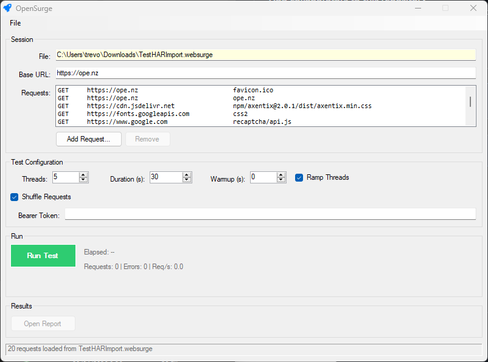

# OpenSurge

A Windows desktop tool for HTTP load testing. Open a session file, configure threads and duration, run the test, and get an interactive HTML report.

Compatible with the [WebSurge](https://websurge.west-wind.com/) `.websurge` session file format.



---

## Building

Requires .NET 4.5 on Windows (64-bit) and Newtonsoft.Json.dll

```
compile.bat
```

## Loading a Session

There are three ways to load requests into the tool.

### Open a .websurge file

**File > Open Session** (Ctrl+O)

Opens an existing `.websurge` session file. The request list shows each request as `METHOD   Name`.

### Import from Chrome HAR

**File > Import from HAR** (Ctrl+I)

1. In Chrome DevTools, open the **Network** tab and record your traffic.
2. Right-click any request and choose **Save all as HAR with content**.
3. In OpenSurge, use **File > Import from HAR** and select the `.har` file.

All requests are imported. Browser-internal headers (`sec-fetch-*`, `accept-encoding`, HTTP/2 pseudo-headers, etc.) are stripped automatically. You can review and clean up the list using the Remove button or by double-clicking to edit individual requests.

### Add requests manually

Click **Add Request...** below the request list to open the request editor. Fill in:

| Field | Description |
|---|---|
| Name | Display name used in the report. Defaults to the URL if left blank. |
| Method | GET, POST, PUT, PATCH, DELETE, HEAD, or OPTIONS. |
| URL / Path | Full URL (`https://...`) or a relative path appended to the Base URL. |
| Headers | One header per line in `Name: Value` format. |
| Body | Request body for POST, PUT, and PATCH requests. |

Double-click any request in the list to edit it. Select a request and click **Remove** to delete it.

### Saving a session

**File > Save Session As** (Ctrl+S)

Saves the current request list as a `.websurge` file. Useful after building a session by hand or cleaning up a HAR import. The saved file can be reopened in OpenSurge or the original WebSurge tool.

---

## Base URL

If your requests use relative paths (e.g. `/api/users`), enter the target server in the **Base URL** field:

```
https://myserver.example.com
```

Requests that already contain a full URL are sent as-is and ignore the Base URL field.

---

## Test Configuration

| Setting | Description |
|---|---|
| Threads | Number of concurrent requests. Start low (5-10) and increase until you find the server's limit. |
| Duration (s) | How long to run the test, in seconds, not counting warmup. |
| Warmup (s) | Seconds of traffic sent before the timed test begins. Warmup requests are not recorded. Useful for warming up connection pools and caches. |
| Ramp Threads | When checked, starts with 1 thread and linearly increases to the target thread count over the first third of the test duration. |
| Shuffle Requests | When checked, randomises the request order each time the list cycles through. |
| Bearer Token | If set, adds `Authorization: Bearer <token>` to every request. Leave blank if your requests already include auth headers, or if the target does not require authentication. |

---

## Running the Test

Click **Run Test**. The button turns red and becomes **Stop Test**.

While the test runs, the panel shows:

- **Elapsed** time vs. total expected duration (warmup + test).
- **Requests**, **Errors**, and **Req/s** updated every second.

Click **Stop Test** at any time to end early. A partial report is still generated from whichever requests completed.

When the test finishes, the report is generated automatically. Click **Open Report** to view it in your default browser.

---

## The HTML Report

The report is a self-contained HTML file saved alongside the results CSV in the application folder. It contains:

**KPI summary bar**

| Metric | Description |
|---|---|
| Req/s | Total requests divided by test duration. |
| Avg TPS | Successful requests (non-error) per second. |
| Avg TTFB | Average time from sending the request to receiving the first response byte. |
| Avg Download | Average time to read the full response body after the first byte. |
| Avg Total | TTFB + Download combined. |
| p50 / p95 / p99 | Percentile response times for the total duration. |
| Min / Max | Fastest and slowest individual requests. |
| Throughput | Response data received per second (KB/s). |
| Errors / Error Rate | Count and percentage of failed requests (network errors + 4xx/5xx responses). |

**Endpoints table**

Per-endpoint breakdown: request count, error count and percentage, average TTFB, average download, average total, and p95.

**Charts**

1. Concurrent requests over duration (step chart showing thread count over time).
2. Response time scatter (blue: normal, red: outliers above p95).
3. Requests per second over duration (green: success, red: errors).
4. Response time distribution (histogram).
5. Status code breakdown (doughnut chart).
6. Average TTFB vs. download time by endpoint (stacked bar).
7. Average and p95 response time by endpoint.
8. Request count by endpoint.

---

## Output Files

Each test run produces two timestamped files in the application folder:

| File | Description |
|---|---|
| `results-YYYYMMDD-HHmmss.csv` | Raw per-request data (name, status code, TTFB, download, total, bytes, timestamp). |
| `results-YYYYMMDD-HHmmss.html` | Self-contained interactive report. |

Old result files are not overwritten. Delete them manually when no longer needed.

---

## Tips

- **Establish a baseline first.** Run with a single thread and short duration to confirm all requests succeed before adding load.
- **Use Ramp Threads** for realistic load testing. A sudden spike of threads can produce misleading results if the server or network has a cold-start overhead.
- **Filter your HAR import.** HAR files from busy pages often include CDN assets (fonts, images, analytics). Remove those requests before running to focus the test on your actual endpoints.
- **Set Warmup** to at least 10-30 seconds when testing servers with connection pooling or JVM-based applications. This ensures the p95/p99 figures reflect steady-state performance, not startup latency.
- **Watch TTFB vs. Download separately.** High TTFB points to server-side processing time. High download time points to large response payloads or network bandwidth limits.